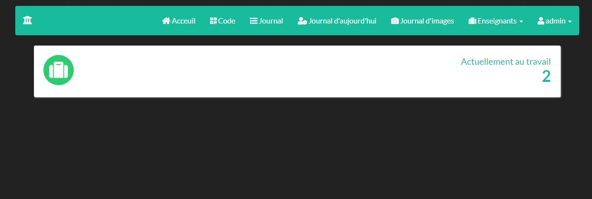
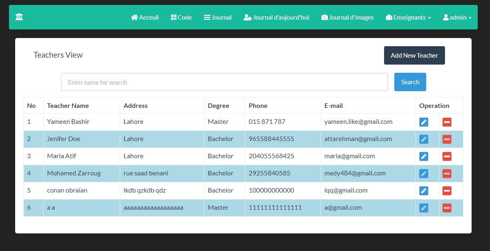

# work-log
Web (php) application  managing workers(teachers) logging + android application for logging

### Setup

Copy pointage folder into htdocs in "xampp" and go to localhost/phpmyadmin and import the database found in the pointage folder
go to localhost/pointage and you are ready to go for the web (username: admin | password: admin)

### Some Screenshots

#### Generating qr to capture with android app

#### Admin home page

#### Listing teachers

